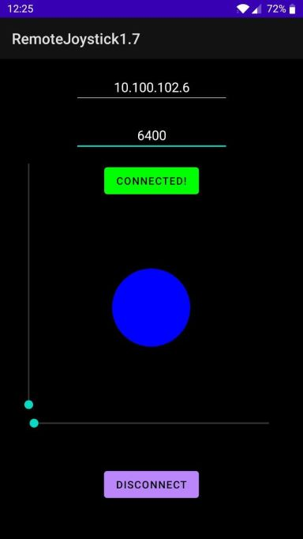
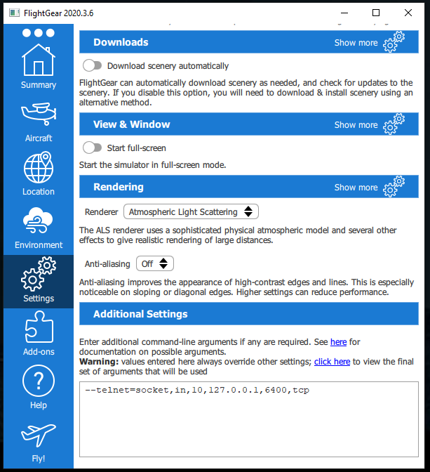

# Flight simulator android app
An android application built with Java, designed with MVVM architecture. An app controlling a plane's movement which is simulated in the simulation software FlightGear.

## Main Objectives
*  Building an android app using Android Studio IDE.
*  Implementing the project using MVVM architecture.

## App's Features
* Connection button to connect to Flight Gear simulator software after giving correct IP address and port number.
* Joystick controller to control the plane's aileron (right and left movement) and elevators (up and down movement).
* Two seekbars 
	* a vertical seekbar - to control the plane's throttle.
	* a horizontal seekbar - to control the plane's rudder.
* Disconnect button to disconnect from the simulator if needed.

## Requirements
-  Android Studio 2020.3.1 installed.
-   FlightGear 2020.3.8 or higher.

## Compiling and running the app
1. clone this repo to your computer.
2. open the project folder in android studio.
3. build the project
4. run the project through an android simulator or via an android phone connected to our computer.
5. Open Flight Gear -> settings -> Additional Settings and set them as in the picture below.
6. click on "Fly!" to start the simulator.
7. To start the simulation, in the tool bar, Cessna C172P -> Autostart. (To change the plane view click on 'v')

## Useful Links
* [Project's UML  diagram.](https://github.com/horskyyaron/RemoteFlightSimulatorJoystickAndroidApp/blob/master/ReadMePics/UML.png)
* [short instructional video about the project.](https://www.youtube.com/watch?v=UNd7jjYecPI&ab_channel=Csvideos)

### Bonus Tip
* To make the plane move, start at a lower speed and gradually increase (as seen in the instructional video above)

